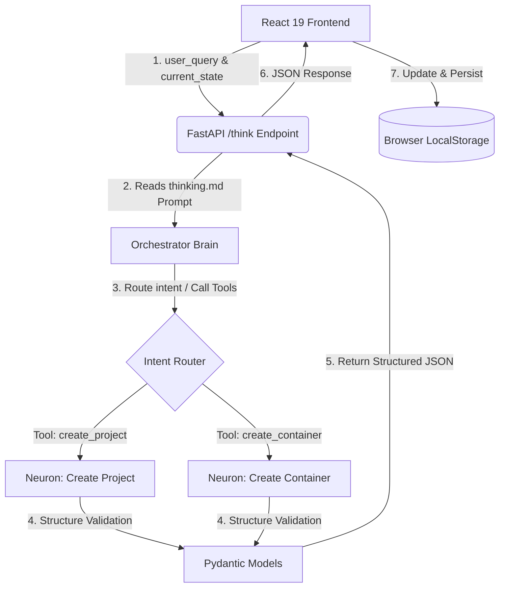

# 🪐 Riley — AI-Powered Project Orchestration Hub

[](https://react.dev/)
[](https://tailwindcss.com/)
[](https://fastapi.tiangolo.com/)
[](https://www.python.org/)
[](https://vite.dev/)
[](https://groq.com/)

**Riley** is a premium, AI-driven project management and structured orchestration platform. It merges a high-fidelity, visually rich React 19 frontend with a robust, asynchronous Python backend powered by Groq's high-performance LLMs. 

Unlike traditional rigid project management software, Riley acts as an agentic partner—interpreting natural language queries, dynamically generating modular information "containers" (e.g., problems, scope, requirements, user stories, risks), and mapping complex project workflows in real-time.

---

## 📸 Core Features

*   **Intelligent Intent Routing (The Brain)**: A centralized FastAPI router `/think` parses user requests to determine if external tools are needed, executing them dynamically in a structured sequence.
*   **Micro-Neuron Specialized Workers**: Leverages specialized, markdown-defined system prompts (e.g., `create_project`, `create_container`) to map LLM outputs directly into strict Pydantic structures.
*   **High-Aesthetic Frontend**: Built on **React 19 + Vite + Tailwind CSS v4** featuring responsive, modern layouts with interactive canvas-based dither animations (Three.js/Fiber), spotlight card interactions, and motion-enhanced modals.
*   **Modular Container Architecture**: Information is organized into flexible, independent cards (containers) that can represent objectives, risks, design decisions, or custom standalone informational segments.
*   **Full Data Portability**: Supports backing up/exporting entire projects or select container collections as standard JSON files, and easily importing them back.
*   **Zero-Config Client-Side State**: Persists work session-to-session locally in `localStorage` for responsive client-side performance.

---

## 📐 Architecture & Workflow

Riley operates on a clean client-server architecture. The frontend handles state, animations, and local storage, while the backend processes logical tasks and interfaces with the LLM orchestrator.



---

## 📂 Repository Structure

```filepath
RileyRoot/
├── Riley/                  # Frontend Application (React 19 + TypeScript + Vite)
│   ├── src/
│   │   ├── app/            # Main application layouts, routing & chat components
│   │   ├── components/     # UI elements (SpotlightCard, Dither Canvas, Modals)
│   │   ├── services/       # Chat response checkers & API communication
│   │   ├── types/          # TypeScript interface definitions for projects
│   │   └── utils/          # General helpers
│   ├── package.json
│   └── vite.config.ts
│
├── RileyAI/                # Backend Service (Python FastAPI + Groq SDK)
│   ├── src/
│   │   ├── api/            # API routers (brain.py, neuron.py)
│   │   ├── service/        # Core business logic (intent parsing, JSON mapping)
│   │   ├── sys_prompts/    # Markdown-based system prompts for the AI
│   │   ├── tools/          # Tool definitions (create_project, create_container)
│   │   └── types/          # Pydantic schema validation models (calendar, project, AI)
│   ├── main.py             # Server entrypoint (uvicorn)
│   └── requirements.txt    # Python dependencies
│
├── github_about.txt        # GitHub About section short description
└── package.json            # Monorepo setup scripts & workspace management
```

---

## 🚀 Setup & Installation

### Prerequisites
*   [Node.js](https://nodejs.org/) & [pnpm](https://pnpm.io/)
*   [Python 3.10+](https://www.python.org/)
*   A [Groq API Key](https://console.groq.com/)

---

### Step-by-Step Installation

1.  **Clone the Repository**:
    ```bash
    git clone https://github.com/your-username/Riley.git
    cd Riley
    ```

2.  **Configure Environment Variables**:
    *   Create a `.env` file in **`RileyAI/`**:
        ```env
        GROQ_API_KEY=your_groq_api_key_here
        ```
    *   Create a `.env` file in **`Riley/`**:
        ```env
        VITE_BACKEND_URL=http://127.0.0.1:8000
        ```

3.  **Setup Backend Virtual Environment & Dependencies**:
    ```bash
    cd RileyAI
    python3 -m venv .venv
    source .venv/bin/activate
    pip install -r requirements.txt
    cd ..
    ```
    *(Note: If a requirements.txt file isn't present, make sure FastAPI, Uvicorn, Groq, Pydantic, and python-dotenv are installed: `pip install fastapi uvicorn groq pydantic python-dotenv`)*

4.  **Install Frontend Dependencies**:
    ```bash
    cd Riley
    pnpm install
    cd ..
    ```

5.  **Install Root Dependencies**:
    Install monorepo tools (like `concurrently`) in the root directory to run both processes together:
    ```bash
    pnpm install
    ```

---

## 🎮 Running the Application

To run the frontend and backend servers concurrently, execute the root runner command:

```bash
pnpm run Riley
```

*   **Frontend Dev Server**: [http://localhost:5173](http://localhost:5173)
*   **FastAPI Backend Server**: [http://127.0.0.1:8000](http://127.0.0.1:8000)
*   **API Interactive Docs (Swagger UI)**: [http://127.0.0.1:8000/docs](http://127.0.0.1:8000/docs)

---

## 🗺️ Project Roadmap

- [ ] **Dynamic Calendar Integration**: Fully integrate calendar scheduling and date-based task cell creation directly linked to user prompts.
- [ ] **Universal Projects Importer**: Add frontend capabilities to parse and import custom external JSON lists of projects natively.
- [ ] **Document-to-RAG (Similarity Search)**: Integrate Microsoft's `MarkItDown` library with a FAISS vector database to enable contextual search across project docs.
